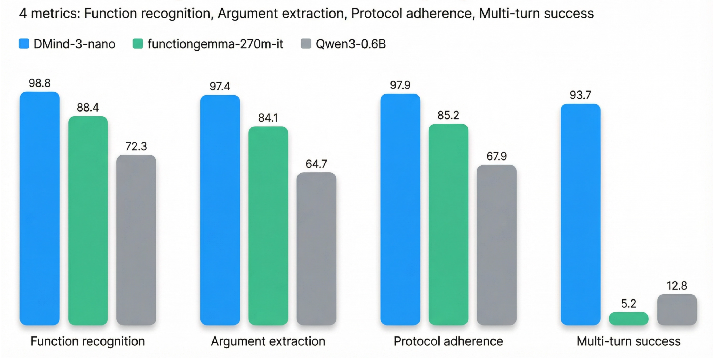

# DMind-3-Nano-270M

<div align="center">
  
</div>

<hr>

<div align="center">
    <a href="https://dmind.ai/">
    
  </a>
  <a href="https://huggingface.co/DMindAI">
    
  </a> 
  <a href="https://x.com/dmind_ai">
    
  </a> 
  <a href="https://discord.com/invite/Zvyq2hPFB7">
    
  </a>
  <a href="https://opensource.org/licenses/Apache-2.0">
    
  </a>
  <a href="MODEL-LICENSE">
    
  </a>
  <a href="http://arxiv.org/abs/2602.11651">
    
  </a>
  
</div>

## Table of Contents
- [Introduction](#introduction)
- [1. Model Overview](#1-model-overview)
- [2. Performance Snapshot](#2-performance-snapshot)
- [3. Highlights](#3-highlights)
- [4. Why This Matters for Web3](#4-why-this-matters-for-web3)
- [5. Tool Definitions & Schemas](#5-tool-definitions--schemas)
- [6. Repository Layout](#6-repository-layout)
- [7. Quickstart](#7-quickstart)
  - [7.1 Model Downloads](#71-model-downloads)
  - [7.2 Training & Eval](#72-training--eval)
- [Limitations & Disclaimer](#limitations--disclaimer)
- [License](#license)
- [Citation](#citation)
- [Contact](#contact)


## Introduction

### 🛡️ DMind-3-nano: Privacy-First On-Device Crypto Intent Recognition

> *Inference stays on your device. Standardized function calling for wallets, DEXs, and agents.*

DMind-3-nano is a small, edge-optimized language model fine-tuned for **crypto wallet and DEX intent recognition** using standardized function-calling protocols. It is designed to run **entirely on-device**, enabling privacy-preserving, low-latency intent parsing for Web3 wallets and local agents.

In the 24/7 PVP environment of DeFi, traditional Copilots are merely assistants. You need an **Agent** capable of independent risk assessment. DMind-3-nano was engineered to arm the individual against institutional extraction — keeping your Alpha strategies local, private, and antifragile.

🛡️ **DMind-3-nano** is your Shield. ⚔️ **DMind-3-mini** is your Spear. 🔮 **DMind-3** is your Oracle.


## 1. Model Overview

| Property | Value |
| --- | --- |
| **Model Name** | DMind-3-nano |
| **Organization** | DMindAI |
| **Base Architecture** | google/functiongemma-270m-it |
| **Parameter Count** | 270M |
| **Context Window** | 2048 tokens |
| **Precision** | BF16 (train) |
| **Supported Chains** | Solana, Ethereum, BSC, Base |
| **Best Tokens** | SOL, USDC, JUP, RAY, BONK, WIF, ETH, BTC, POPCAT, BOME, TRUMP |
| **Deployment** | On-device: phones, tablets, edge CPUs |

> **Experimental notice:** Highest accuracy on the token/chain set above; other assets may need further tuning. Validate outputs before transacting.


## 2. Performance Snapshot

<div align="center">
  
</div>

*(Figure 1: DMind-3-nano significantly outperforms both the untuned base model and a similarly sized general-purpose model (Qwen3-0.6B), especially in multi-turn success.)*


## 3. Highlights

- 🔐 **Privacy-first**: 100% on-device intent recognition; no data leaves the device.
- 📱 **Edge-optimized**: 270M params; runs on phones/tablets/edge CPUs.
- 🔄 **Standardized protocols**: `SEARCH_TOKEN` / `EXECUTE_SWAP` with unified schemas.
- 🌐 **Multi-chain**: Solana, Ethereum, BSC, Base.
- 🌍 **Multilingual**: English + Chinese intents.
- 🤖 **Agent-native**: Designed for local-first wallet/agent workflows where a growing share of trading decisions and execution happen **on-device**.
- 📊 **Training data**: The final full fine-tune used **12,000+** samples in total; **60%+** comes from **real trading scenarios**.
- 🧾 **(To our knowledge) first public vertical-domain FunctionGemma case study**: An end-to-end example of fine-tuning `google/functiongemma-270m-it` for a real wallet/DEX intent domain.


## 4. Why This Matters for Web3

### Standardization as a Step-Change

Web3 is composable at the protocol layer (tokens, RPCs), but still fragmented at the **intent layer**. Today every wallet, DEX, and agent framework invents its own "swap/search intent" schema and function-calling format. The result is high integration cost, brittle adapters, inconsistent safety guarantees, and poor ecosystem interoperability.

This work targets a transformative goal: **standardize wallet intents** as a small, versionable protocol between natural language and transaction builders. Concretely, DMind-3-nano enforces a minimal set of typed tools (e.g. `SEARCH_TOKEN`, `EXECUTE_SWAP`) with strict schemas and a deterministic wrapper output format.

What standardization unlocks:

- **Interoperability**: One protocol works across wallets/DEXs/agents; integrations become plug-and-play.
- **Safety & auditability**: Tool calls are structured data — easy to validate, simulate, policy-check, and display for confirmation before signing.
- **Benchmarkability**: Shared datasets and comparable evaluations across models and releases.
- **Ecosystem scaling**: New tools can be added via versioning without breaking existing clients.

DMind-3-nano is not only a model — it is a proposal for a **standard protocol layer** that can make wallet intelligence as interoperable as ERC-20 made tokens.

### The Next Wave: Local Agents Executing Trades

We expect a large share of future Web3 activity to be **agent-driven**: wallets will run local copilots that continuously parse user intent, monitor context, and propose/execute transactions. In that world, "cloud-only" intelligence becomes a bottleneck and a risk:

- **Privacy**: Trading intent, token preferences, and behavioral signals should not be streamed to third-party servers.
- **Latency & reliability**: Agents must work instantly and offline (mobile, hardware wallets, poor connectivity).
- **Security boundaries**: Local agents can keep a tighter loop between intent → policy checks → simulation → user confirmation → signing.

This is why a small, high-accuracy **on-device function-calling model** is necessary infrastructure for the agent-native wallet era.


## 5. Tool Definitions & Schemas

To ensure interoperability, DMind-3-nano uses strict JSON schemas for tool definitions.

### SEARCH_TOKEN
Used to find token metadata or address on a specific chain.

```json
{
  "name": "SEARCH_TOKEN",
  "description": "Search for a cryptocurrency token on-chain to retrieve its metadata or address.",
  "parameters": {
    "type": "object",
    "properties": {
      "symbol": {
        "type": "string",
        "description": "The ticker symbol of the token (e.g., 'SOL', 'USDC')."
      },
      "address": {
        "type": "string",
        "description": "The specific contract address (CA) of the token, if known."
      },
      "chain": {
        "type": "string",
        "enum": ["solana", "ethereum", "bsc", "base"],
        "description": "The target blockchain network."
      },
      "keyword": {
        "type": "string",
        "description": "General search keywords (e.g., project name) if symbol/address are unclear."
      }
    },
    "required": []
  }
}
```

### EXECUTE_SWAP
Used to construct a swap transaction intent between two assets.

```json
{
  "name": "EXECUTE_SWAP",
  "description": "Propose a token swap transaction.",
  "parameters": {
    "type": "object",
    "properties": {
      "inputTokenSymbol": {
        "type": "string",
        "description": "Symbol of the token being sold (e.g., 'SOL')."
      },
      "inputTokenCA": {
        "type": "string",
        "description": "Contract address of the token being sold."
      },
      "outputTokenCA": {
        "type": "string",
        "description": "Contract address of the token being bought."
      },
      "inputTokenAmount": {
        "type": "number",
        "description": "Absolute amount of input token to swap."
      },
      "inputTokenPercentage": {
        "type": "number",
        "description": "Percentage of balance to swap (0.0 to 1.0), used if exact amount is not specified."
      },
      "outputTokenAmount": {
        "type": "number",
        "description": "Minimum amount of output token expected (optional/slippage related)."
      }
    },
    "required": ["inputTokenSymbol"]
  }
}
```

### Output Format
The model outputs the function call wrapped in special tokens (standard FunctionGemma format):

```plaintext
<start_function_call>call:FUNCTION_NAME{key1:val1, key2:val2}<end_function_call>
```

**Example:**

User: "Search for SOL on Solana"

Model:
```plaintext
<start_function_call>call:SEARCH_TOKEN{symbol:"SOL", chain:"solana"}<end_function_call>
```


## 6. Repository Layout

- `model/` — Experimental model weights (use at your own risk in production)
- `src/` — Training/eval utilities
  - `train.py` (LoRA or full fine-tune)
  - `evaluate.py` (benchmark evaluation)
  - `prepare_dataset.py` (SFT-ready formatting)
  - `generate_benchmark.py` (100-case benchmark)
  - `config.py` (tools, prompts, token maps)
- `data/` — Sample data
  - `training_data.json` (raw; open-sourced subset for reproducibility)
  - `benchmark_dataset.json` (eval set; includes Chinese test prompts by design)
- `results/evaluation_results.json` — Sample output
- `run_training.sh`, `requirements.txt`


## 7. Quickstart

### 7.1 Model Downloads

| **Model** | **Base Model** | **Download** |
|:-:|:-:|:-:|
| DMind-3-Nano-270M | google/functiongemma-270m-it | [Hugging Face Link](https://huggingface.co/DMindAI/DMind-3-nano) |

### 7.2 Training & Eval

Install:
```bash
pip install -r requirements.txt
```

Train (LoRA default):
```bash
python -m src.train \
  --model_path /path/to/functiongemma-270m-it \
  --dataset_path ./data/training_data.json \
  --output_dir ./runs \
  --bf16
```
Switch to full fine-tune: add `--no-use-lora`. Use `--use_4bit/--use_8bit` + `--gradient_checkpointing` for low memory.

Evaluate:
```bash
python -m src.evaluate \
  --model_path ./runs/<run>/final_model \
  --benchmark_path ./data/benchmark_dataset.json \
  --output_path ./results/eval_$(date +%Y%m%d_%H%M%S).json
```

Data utilities:
```bash
# Prepare SFT data
python -m src.prepare_dataset --input ./data/training_data.json --output ./data/prepared_dataset.json
# Regenerate benchmark
python -m src.generate_benchmark --output ./data/benchmark_dataset.json
```


## Limitations & Disclaimer

- **Experimental Release**: This is a bold exploratory release. We do not take responsibility for any financial losses incurred from using this model in production environments.
- **Token Coverage**: Highest accuracy on the supported token/chain set. Other assets may need further tuning.
- **Knowledge Cutoff**: Specific protocol data is limited to the training cutoff. Use with RAG for real-time data.
- **Legal Disclaimer**: This model is an **analytical tool**, not a financial advisor. The output (NFA) should never be the sole basis for investment decisions.


## License
- Code: MIT
- Model card intent: Apache 2.0
- Protocol specs (`SEARCH_TOKEN` / `EXECUTE_SWAP`): Public domain for maximal adoption.
- **Base Models:**
  - DMind-3-Nano-270M is derived from google/functiongemma-270m-it, originally licensed under the [Gemma License](https://ai.google.dev/gemma/terms).
- Contributions are welcome via issues/PRs.


## Citation

If you use DMind-3 in your research, please cite our paper:

**DMind-3: A Sovereign Edge--Local--Cloud AI System with Controlled Deliberation and Correction-Based Tuning for Safe, Low-Latency Transaction Execution**  
Enhao Huang, Frank Li, Tony Ling, Lowes Yang  
*arXiv preprint arXiv:2602.11651*, 2026  
[[arXiv]](http://arxiv.org/abs/2602.11651) [[PDF]](http://arxiv.org/pdf/2602.11651)

```bibtex
@misc{huang2026dmind3,
  title={DMind-3: A Sovereign Edge--Local--Cloud AI System with Controlled Deliberation and Correction-Based Tuning for Safe, Low-Latency Transaction Execution},
  author={Huang, Enhao and Li, Frank and Ling, Tony and Yang, Lowes},
  journal={arXiv preprint arXiv:2602.11651},
  year={2026}
}
```


## Contact
For questions or support, please contact team@dmind.ai

- 🌐 Project Homepage: [https://dmind.ai](https://dmind.ai)
- 💬 Community Discussion: [Discord](https://discord.com/invite/Zvyq2hPFB7)
- 🐦 Twitter: [@dmind_ai](https://x.com/dmind_ai)
